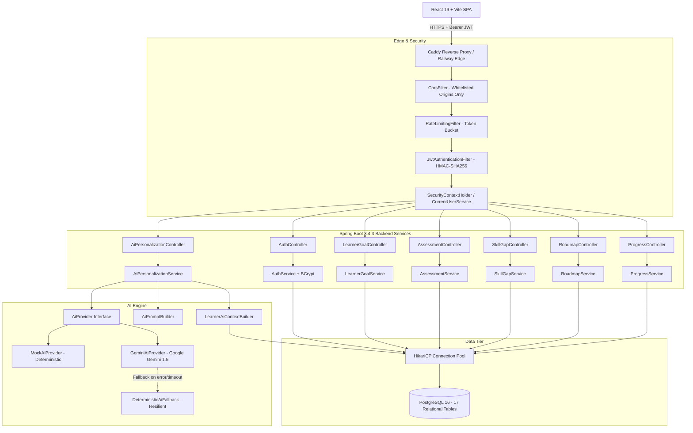
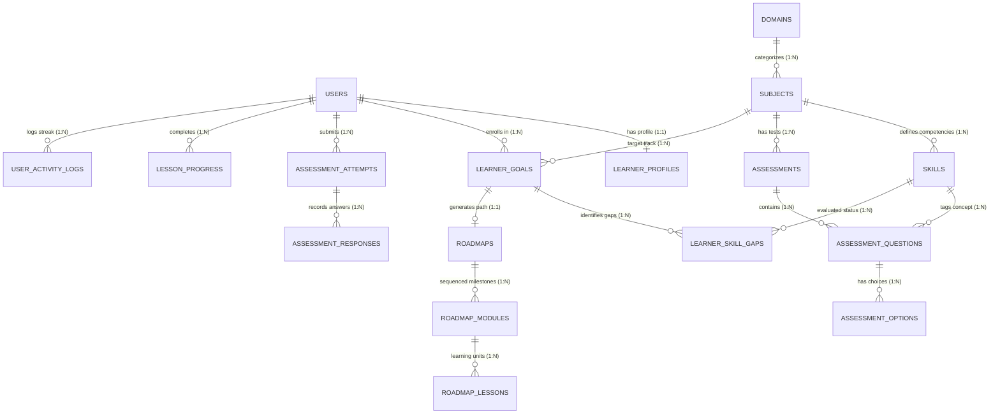

# JNANORA — AI-Powered Personalized Learning & Skill-Development Platform

[](https://spring.io/projects/spring-boot)
[](https://www.oracle.com/java/)
[](https://react.dev/)
[](https://vitejs.dev/)
[](https://www.postgresql.org/)
[](https://railway.app/)
[]()
[](LICENSE)

> **Live Deployment:**  
> 🌐 **Frontend Application:** [https://bodha-frontend-production.up.railway.app](https://bodha-frontend-production.up.railway.app)  
> 🔌 **Backend API Health:** [https://bodha-backend-production.up.railway.app/api/health](https://bodha-backend-production.up.railway.app/api/health)

---

## 1. Overview

**Jnanora** is an AI-powered personalized learning platform that creates structured, adaptive educational paths for **any discipline**—from backend systems and applied mathematics to conversational languages and product strategy.

Modern self-paced learning is overwhelmingly fragmented: learners bounce between video tutorials, disorganized documentation, and unstructured chatbot conversations without measuring real competency. Jnanora replaces passive browsing with an **authoritative, closed-loop pedagogical engine**:

```
Learner ──► Subject Catalog ──► Goal Calibration ──► Diagnostic Assessment
                                                             │
                                                             ▼
Progress Dashboard ◄── Personalized Roadmap ◄── Skill-Gap Isolation
        │
        ▼
Grounded AI Recommendations & Next-Step Guidance
```

---

## 2. Why Jnanora is Not a "Generic CRUD App" or "ChatGPT Wrapper"

| Dimension | Generic CRUD Application | Typical "ChatGPT Wrapper" | **Jnanora Platform** |
|---|---|---|---|
| **Curriculum Structure** | Static lists of links or videos | AI generates arbitrary text on each prompt | **Relational, milestone-based roadmaps sequenced by prerequisite hierarchy** |
| **Competency Measurement** | None (self-reported checkboxes) | Ephemeral quiz generated with hallucinations | **Deterministic diagnostic evaluation tagged to atomic skill competencies** |
| **Learner State** | Basic profile row | None (resets every session) | **Persistent skill-gap matrix (`MASTERED`, `NEEDS_REVIEW`, `CRITICAL_GAP`)** |
| **AI Role** | None | Raw unconstrained LLM answers | **Grounded analytical copilot operating on real assessment metrics and roadmap milestones** |
| **Security Architecture** | Basic username/password | Client-side API key exposure | **Cryptographic JWT (HMAC-SHA256), BCrypt, server-side identity, token-bucket rate limiting** |
| **Fault Tolerance** | Standard DB errors | Broken UI when OpenAI/Gemini times out | **Zero-downtime deterministic fallback guaranteeing uninterrupted learning** |

---

## 3. Core Features & Capabilities

- 🎯 **Universal Knowledge Taxonomy:** Supports multiple disciplines (`Software Engineering`, `Mathematics & Data`, `Languages & Linguistics`, `Business & Leadership`) with extensible domain models.
- ⏱️ **Outcome-Based Goal Calibration:** Learners specify outcome targets (`career`, `exam`, `project`, `mastery`), self-reported baseline levels, and daily time commitments (15, 30, 45, 60 mins).
- 🧪 **Diagnostic Benchmark Engine:** Server-side multiple-choice diagnostic assessments. Answer keys (`isCorrect`) are concealed pre-submission to prevent client-side inspection.
- 🔍 **Granular Skill-Gap Isolation:** Analyzes response telemetry per question to categorize underlying skills into `MASTERED`, `NEEDS_REVIEW`, or `CRITICAL_GAP`.
- 🗺️ **Personalized Roadmap Synthesis:** Dynamically constructs sequenced modules and lessons. Prioritizes identified gaps first, followed by core principles and applied capstones.
- 📈 **Study Tracking & Gamification:** Tracks lesson completion states (`NOT_STARTED`, `IN_PROGRESS`, `COMPLETED`), daily consistency streaks, and cumulative XP.
- 🤖 **Grounded AI Copilot:** 
  - **Immediate Next Step:** Directs the learner to their single highest-impact pedagogical action.
  - **Personalized Remediation:** Recommends targeted learning approaches and practice exercises for detected gaps.
  - **Socratic Lesson Tutor:** Context-aware assistant that guides learners without giving away answers.
- 🛡️ **Enterprise Security & Isolation:** Strict server-side identity derivation (`CurrentUserService`), preflight CORS origin whitelisting, HTTP security headers, and sanitized error responses.

---

## 4. System Architecture

BODHA is architected as a decoupled, multi-tier system with strict separation of concerns:



---

## 5. Technology Stack

### Backend
- **Framework:** Spring Boot 3.4.3
- **Language:** Java 21 LTS
- **Security:** Spring Security 6.4 + JJWT 0.12.6 (HMAC-SHA256)
- **Hashing:** BCrypt Password Encoder (10 rounds)
- **Data Access:** Spring Data JPA + Hibernate 6.6
- **Database:** PostgreSQL 16
- **Connection Pool:** HikariCP
- **Validation:** Jakarta Bean Validation (Hibernate Validator)
- **Testing:** JUnit 5, Mockito, Spring Boot Test (70/70 tests passing)

### Frontend
- **Framework:** React 19 SPA
- **Build Tool:** Vite 8.3
- **Styling:** Vanilla CSS design tokens + Tailwind CSS 3.4
- **Routing:** React Router DOM 7
- **Icons:** Lucide React
- **HTTP Client:** Native Fetch wrapper with automated JWT injection and 401 interception

### Production Infrastructure
- **Hosting Platform:** Railway
- **Web Server:** Caddy HTTP/2 reverse proxy with SPA client routing
- **Containers:** Nixpacks automated container runtime
- **SSL/TLS:** Automated Edge TLS termination via Railway

---

## 6. Relational Database Architecture

BODHA uses **17 relational tables** with strict referential constraints:



See [docs/DATABASE_DESIGN.md](docs/DATABASE_DESIGN.md) for full table dictionary and indexing strategies.

---

## 7. REST API Overview

| Module | Method | Endpoint | Description | Auth Required |
|---|---|---|---|---|
| **Health** | `GET` | `/api/health` | Service health telemetry | No |
| **Auth** | `POST` | `/api/auth/register` | Register learner account | No (5 RPM) |
| **Auth** | `POST` | `/api/auth/login` | Authenticate with BCrypt check | No (10 RPM) |
| **Catalog** | `GET` | `/api/domains` | List knowledge domains | No |
| **Catalog** | `GET` | `/api/subjects` | List subjects (optional domain filter) | No |
| **Catalog** | `GET` | `/api/subjects/popular`| List curated popular subjects | No |
| **Goals** | `POST` | `/api/goals` | Calibrate new learner goal | **Yes** |
| **Goals** | `GET` | `/api/goals/{id}` | Get goal by ID | **Yes** |
| **Goals** | `GET` | `/api/goals/user/{userId}/active` | Get user's active goal | **Yes** |
| **Assessment**| `GET` | `/api/assessments/subject/{id}/diagnostic` | Get subject diagnostic test | **Yes** |
| **Assessment**| `POST` | `/api/assessments/{id}/attempts` | Start assessment session | **Yes** |
| **Assessment**| `POST` | `/api/attempts/{id}/responses` | Submit answer to question | **Yes** |
| **Assessment**| `POST` | `/api/attempts/{id}/complete` | Score attempt on server | **Yes** |
| **Skill Gap** | `POST` | `/api/attempts/{id}/skill-gaps/analyze` | Compute skill-gap matrix | **Yes** |
| **Skill Gap** | `GET` | `/api/skill-gaps/user/{userId}` | Get user's skill gaps | **Yes** |
| **Roadmap** | `POST` | `/api/goals/{id}/roadmap/generate` | Synthesize customized roadmap | **Yes** |
| **Roadmap** | `GET` | `/api/goals/{id}/roadmap` | Retrieve active roadmap | **Yes** |
| **Progress** | `POST` | `/api/lessons/{id}/start` | Start study on lesson | **Yes** |
| **Progress** | `POST` | `/api/lessons/{id}/complete` | Complete lesson, award XP | **Yes** |
| **Progress** | `GET` | `/api/progress/user/{userId}` | Dashboard metrics summary | **Yes** |
| **AI Copilot**| `GET` | `/api/ai/next-step?goalId={id}` | AI immediate next step | **Yes** (20 RPM) |
| **AI Copilot**| `GET` | `/api/ai/recommendations?goalId={id}` | AI personalized remediation | **Yes** (20 RPM) |
| **AI Copilot**| `POST` | `/api/ai/lessons/{id}/assist` | Socratic lesson tutoring | **Yes** (20 RPM) |

See [docs/API_DOCUMENTATION.md](docs/API_DOCUMENTATION.md) for complete schemas and example payloads.

---

## 8. Local Development Quickstart

You can run BODHA entirely on your local machine with zero external cloud dependencies or Railway credentials.

### Prerequisites
- JDK 21+
- Maven 3.9+
- Node.js 20+
- PostgreSQL 16+

### 1. Database Setup
```bash
# Create local database
psql -U postgres -c "CREATE DATABASE bodha_db;"

# Initialize schema
psql -U postgres -d bodha_db -f database/schema.sql
```
*(Curriculum skills seed script is documented in [docs/DEVELOPMENT_SETUP.md](docs/DEVELOPMENT_SETUP.md))*

### 2. Backend Setup
```bash
cd backend
cp .env.example .env
mvn spring-boot:run
# Backend starts on http://localhost:8080
```

### 3. Frontend Setup
```bash
cd frontend
cp .env.example .env
npm install
npm run dev
# Frontend starts on http://localhost:5173
```

Detailed local setup instructions: [docs/DEVELOPMENT_SETUP.md](docs/DEVELOPMENT_SETUP.md).

---

## 9. Running Tests & Quality Verification

### Backend Test Suite (70 Tests)
```bash
mvn test -f backend/pom.xml
```
```
[INFO] Tests run: 70, Failures: 0, Errors: 0, Skipped: 0
[INFO] BUILD SUCCESS
```
Includes comprehensive security tests:
- `AuthenticationSecurityTests`: BCrypt verification, password exclusion in DTOs, JWT claim integrity.
- `OwnershipAuthorizationTests`: Cross-user parameter tampering isolation across all services.
- `ProductionSecurityTests`: Rate limiting verification, CORS wildcard rejection, SQL leakage sanitization, JWT production secret strength enforcement.

### Frontend Quality & Build
```bash
cd frontend
npm run lint    # 0 errors
npm run build   # Production bundle built in ~200ms
```

---

## 10. AI Personalization Engine & Provider Status

- **Current Production Mode:** Configured with `AI_PROVIDER=mock`.
  - The mock provider uses deterministic heuristics grounded in actual assessment scores and skill gaps.
  - Guarantees zero latency, zero API costs, and 100% test reproducibility.
- **Google Gemini Integration:**
  - Full client integration exists in `com.bodha.service.ai.provider.GeminiAiProvider`.
  - To activate live Gemini calls, simply set `AI_PROVIDER=gemini` and supply `AI_API_KEY` in environment variables.
  - The API key is backend-only and never exposed to the client.
- **Fault-Tolerant Fallback:**
  - `DeterministicAiFallback` automatically catches any upstream network timeout or Gemini quota issue, returning a high-fidelity recommendation without breaking the user experience.

See [docs/AI_ARCHITECTURE.md](docs/AI_ARCHITECTURE.md) for the complete AI design specification.

---

## 11. Project Structure

```
BODHA/
├── .gitignore                     # Comprehensive repository protection rules
├── README.md                      # Root project overview (this file)
│
├── backend/                       # Spring Boot 3.4.3 + Java 21 REST API
│   ├── .env.example               # Safe environment variable template
│   ├── .nixpacks.toml             # Railway deployment container build definition
│   ├── pom.xml                    # Maven configuration and dependencies
│   ├── railway.toml               # Railway backend service specification
│   └── src/
│       ├── main/java/com/bodha/
│       │   ├── controller/        # 7 REST Controllers
│       │   ├── dto/               # Immutable Java Records for request/response
│       │   ├── exception/         # Sanitized global exception handling
│       │   ├── model/             # JPA Relational Entities
│       │   ├── repository/        # 17 Spring Data JPA Repositories
│       │   ├── security/          # JJWT, CurrentUserService, Rate Limiting
│       │   └── service/           # Business logic & AI Grounding Engine
│       └── test/                  # 70 unit and integration tests
│
├── frontend/                      # React 19 + Vite SPA
│   ├── .env.example               # Frontend environment template
│   ├── .gitignore                 # Node/Vite specific ignores
│   ├── .nixpacks.toml             # Frontend Caddy container definition
│   ├── package.json               # Frontend dependencies
│   ├── railway.toml               # Railway frontend service specification
│   ├── vite.config.js             # Vite configuration
│   └── src/
│       ├── components/            # Reusable UI cards, buttons, badges, steppers
│       ├── context/               # LearnerContext state management
│       ├── pages/                 # 8 core journey views
│       └── services/              # Centralized apiFetch HTTP client
│
├── database/                      # Relational database specifications
│   ├── DATABASE_DESIGN.md         # Full PostgreSQL design documentation
│   └── schema.sql                 # DDL schema definition (17 tables)
│
└── docs/                          # Specialized technical documentation
    ├── ARCHITECTURE.md            # System architecture & Mermaid diagrams
    ├── API_DOCUMENTATION.md       # Complete REST API reference
    ├── AI_ARCHITECTURE.md         # AI grounding, prompts & fallback resilience
    ├── DEVELOPMENT_SETUP.md       # Local developer onboarding guide
    └── PRODUCTION_READINESS.md    # Production security & deployment audit log
```

---

## 12. Security & Responsible Disclosure

- **Zero Credentials in Git:** Passwords, API keys, database secrets, and private keys are never committed.
- **Strict Environment Binding:** Secrets must be injected via runtime environment variables.
- **Stateless Sessions:** Token-based authentication eliminates session-fixation and CSRF vulnerabilities.

---

## 13. License

This project is licensed under the [MIT License](LICENSE).
