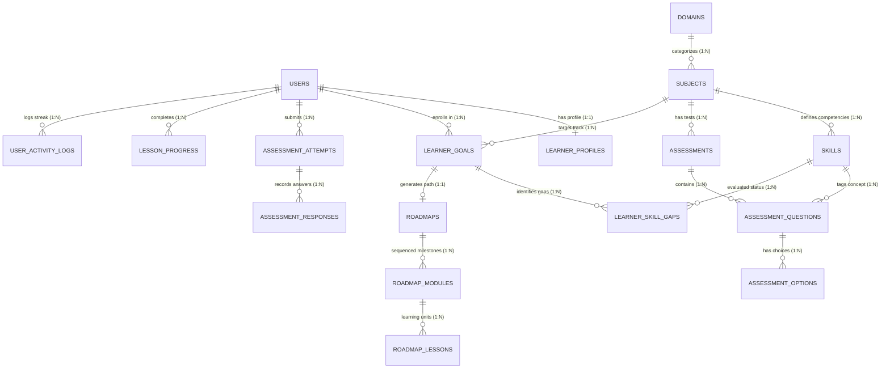
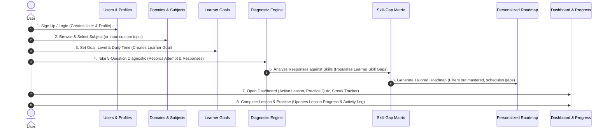

# BODHA (बोध) — Relational Database Architecture & Design Document

## 1. System Overview

**BODHA** is an AI-powered personalized learning and skill-development platform designed for **any** subject or discipline (Software Engineering, Mathematics, Languages, Business, Sciences).

Unlike generic AI chatbots that provide ephemeral, unstructured text answers, BODHA is a **structured learning system** that maintains a persistent learner profile, evaluates knowledge baselines through diagnostic assessments, isolates granular skill gaps, generates dynamic sequenced roadmaps, and adapts with every quiz and lesson completed.

This document details the PostgreSQL relational database design that underpins BODHA's core 8-step user journey.

---

## 2. Core Entity-Relationship Diagram (ERD)

---

## 3. Detailed Table Dictionary

### Module A: Identity & Learner State

#### 1. `users`
- **Purpose**: Stores account authentication credentials and user roles.
- **Primary Key**: `id` (`BIGSERIAL`)
- **Foreign Keys**: None
- **Key Columns**:
  - `email`: `VARCHAR(255) UNIQUE NOT NULL` — login identifier
  - `password_hash`: `VARCHAR(255) NOT NULL` — BCrypt hashed password (ready for Spring Security)
  - `full_name`: `VARCHAR(150) NOT NULL`
  - `role`: `VARCHAR(30) DEFAULT 'LEARNER'` (`'LEARNER'`, `'MENTOR'`, `'ADMIN'`)
- **Why Needed**: Foundational identity table required for secure access and data isolation across learners.

#### 2. `learner_profiles`
- **Purpose**: Stores extended learner metadata and global gamification stats (1-to-1 with `users`).
- **Primary Key**: `id` (`BIGSERIAL`)
- **Foreign Keys**: `user_id` $\rightarrow$ `users(id)` (`ON DELETE CASCADE`)
- **Key Columns**:
  - `bio`: `TEXT`
  - `avatar_url`: `VARCHAR(500)`
  - `current_streak_days`: `INTEGER DEFAULT 0` — Powers the consistency flame on Dashboard
  - `total_xp`: `INTEGER DEFAULT 0`
  - `last_active_at`: `TIMESTAMPTZ`
- **Why Needed**: Separates volatile learning stats and profile info from sensitive authentication credentials.

---

### Module B: Universal Domain & Skill Taxonomy

#### 3. `domains`
- **Purpose**: High-level classification of knowledge areas.
- **Primary Key**: `id` (`VARCHAR(50)`) — human-readable slug (e.g. `'programming'`, `'mathematics'`, `'languages'`, `'business'`)
- **Foreign Keys**: None
- **Why Needed**: Allows clean domain filtering in the UI and categorizes tracks broadly.

#### 4. `subjects`
- **Purpose**: Specific learning tracks (e.g. Full-Stack Java, Linear Algebra, Conversational Spanish). Supports both platform-curated tracks and user-created custom topics.
- **Primary Key**: `id` (`VARCHAR(80)`) — slug identifier (e.g. `'java-backend'`, `'linear-algebra'`, `'custom-quantum-computing'`)
- **Foreign Keys**:
  - `domain_id` $\rightarrow$ `domains(id)`
  - `created_by_user_id` $\rightarrow$ `users(id)` (`NULL` for system tracks, populated if custom created by a user)
- **Key Columns**:
  - `title`: `VARCHAR(200) NOT NULL`
  - `tagline`: `VARCHAR(300)`
  - `difficulty_level`: `'Beginner'`, `'Intermediate'`, `'Advanced'`, `'All Levels'`
  - `estimated_weeks`: `INTEGER DEFAULT 6`
  - `is_popular`: `BOOLEAN DEFAULT false`
  - `is_custom`: `BOOLEAN DEFAULT false`
- **Why Needed**: Enables BODHA to support **any** subject without code changes or schema modifications.

#### 5. `skills`
- **Purpose**: Granular competencies and concepts within a subject.
- **Primary Key**: `id` (`BIGSERIAL`)
- **Foreign Keys**: `subject_id` $\rightarrow$ `subjects(id)` (`ON DELETE CASCADE`)
- **Key Columns**:
  - `name`: `VARCHAR(150) NOT NULL` (e.g. `'Spring Core & IoC'`, `'Matrix Decomposition'`, `'Verb Conjugations'`)
  - `category`: `'prerequisite'`, `'core'`, `'advanced'`
  - `description`: `TEXT`
- **Why Needed**: The foundational unit of BODHA's diagnostic engine. Without granular skills, you cannot perform skill-gap analysis.

---

### Module C: Learner Goals & Assessment Engine

#### 6. `learner_goals`
- **Purpose**: Represents a learner's enrollment in a subject, pairing their outcome goal, baseline familiarity, and daily time budget.
- **Primary Key**: `id` (`BIGSERIAL`)
- **Foreign Keys**:
  - `user_id` $\rightarrow$ `users(id)` (`ON DELETE CASCADE`)
  - `subject_id` $\rightarrow$ `subjects(id)` (`ON DELETE CASCADE`)
- **Unique Constraint**: `UNIQUE(user_id, subject_id)`
- **Key Columns**:
  - `goal_type`: `'career'`, `'exam'`, `'project'`, `'mastery'`
  - `baseline_level`: `'beginner'`, `'intermediate'`, `'advanced'`
  - `daily_time_minutes`: `15`, `30`, `45`, `60`
  - `status`: `'ACTIVE'`, `'PAUSED'`, `'COMPLETED'`
- **Why Needed**: Enables a single learner to pursue multiple subjects independently with different paces and objectives.

#### 7. `assessments`
- **Purpose**: Evaluative tests attached to a subject (Initial Diagnostic, Checkpoints, Module Quizzes, Capstones).
- **Primary Key**: `id` (`BIGSERIAL`)
- **Foreign Keys**: `subject_id` $\rightarrow$ `subjects(id)` (`ON DELETE CASCADE`)
- **Key Columns**:
  - `title`: `VARCHAR(200) NOT NULL`
  - `assessment_type`: `'DIAGNOSTIC'`, `'MODULE_QUIZ'`, `'CHECKPOINT'`, `'FINAL_CAPSTONE'`
- **Why Needed**: Distinguishes diagnostic baseline assessments from module-level practice recall quizzes.

#### 8. `assessment_questions`
- **Purpose**: Question items belonging to an assessment, tagged directly to a specific skill.
- **Primary Key**: `id` (`BIGSERIAL`)
- **Foreign Keys**:
  - `assessment_id` $\rightarrow$ `assessments(id)` (`ON DELETE CASCADE`)
  - `skill_id` $\rightarrow$ `skills(id)` (`ON DELETE SET NULL`)
- **Key Columns**:
  - `question_text`: `TEXT NOT NULL`
  - `explanation`: `TEXT`
  - `order_index`: `INTEGER DEFAULT 1`
- **Why Needed**: Direct foreign key to `skills` allows BODHA to know *exactly* which skill was answered right or wrong.

#### 9. `assessment_options`
- **Purpose**: Multiple-choice options for each question.
- **Primary Key**: `id` (`BIGSERIAL`)
- **Foreign Keys**: `question_id` $\rightarrow$ `assessment_questions(id)` (`ON DELETE CASCADE`)
- **Key Columns**:
  - `option_text`: `TEXT NOT NULL`
  - `is_correct`: `BOOLEAN NOT NULL DEFAULT false`
  - `order_index`: `INTEGER DEFAULT 1`
- **Why Needed**: Normalized 3NF representation of answer choices.

#### 10. `assessment_attempts` & `assessment_responses`
- **Purpose**: Complete audit trail of every test taken by a learner.
- **Primary Key**: `id` (`BIGSERIAL`)
- **Relationships**:
  - `assessment_attempts` links `user_id`, `assessment_id`, and `learner_goal_id`, recording `score_percentage`, `total_questions`, `correct_answers`, and `completed_at`.
  - `assessment_responses` links each attempt to individual `question_id`, `selected_option_id`, and `is_correct`.
- **Why Needed**: Powers historical score tracking, re-attempt comparisons, and provides the raw data to compute skill gaps.

---

### Module D: Skill-Gap Analysis

#### 11. `learner_skill_gaps`
- **Purpose**: The core diagnostic matrix of BODHA. Stores whether a skill is verified as mastered or identified as a learning gap.
- **Primary Key**: `id` (`BIGSERIAL`)
- **Foreign Keys**:
  - `user_id` $\rightarrow$ `users(id)` (`ON DELETE CASCADE`)
  - `learner_goal_id` $\rightarrow$ `learner_goals(id)` (`ON DELETE CASCADE`)
  - `skill_id` $\rightarrow$ `skills(id)` (`ON DELETE CASCADE`)
  - `evaluated_from_attempt_id` $\rightarrow$ `assessment_attempts(id)` (`ON DELETE SET NULL`)
- **Unique Constraint**: `UNIQUE(user_id, learner_goal_id, skill_id)`
- **Key Columns**:
  - `status`: `'MASTERED'`, `'GAP'`
  - `gap_severity`: `'HIGH'`, `'MEDIUM'`, `'LOW'`, or `NULL`
  - `reason`: `TEXT` (e.g. `'Required to prevent N+1 queries and handle data transactions'`)
- **Why Needed**: Directly powers the **Skill-Gap Analysis** screen (`/skill-gap`). Ensures the curriculum generator skips mastered prerequisites and focuses only on high-severity deficiencies.

---

### Module E: Personalized Roadmaps & Progress Tracking

#### 12. `roadmaps`
- **Purpose**: The dynamic, tailored learning path generated for a learner goal.
- **Primary Key**: `id` (`BIGSERIAL`)
- **Foreign Keys**:
  - `user_id` $\rightarrow$ `users(id)` (`ON DELETE CASCADE`)
  - `learner_goal_id` $\rightarrow$ `learner_goals(id)` (`ON DELETE CASCADE`)
- **Unique Constraint**: `UNIQUE(learner_goal_id)`
- **Key Columns**:
  - `title`: `VARCHAR(255) NOT NULL`
  - `curated_recommendation`: `TEXT` (Pedagogical advice generated from diagnostic results)
  - `overall_progress_percentage`: `INTEGER DEFAULT 0`
  - `is_active`: `BOOLEAN DEFAULT true`
  - `ai_generated`: `BOOLEAN DEFAULT false` (Prepared for future LLM synthesizer)
- **Why Needed**: Serves as the parent container for the learner's personalized curriculum.

#### 13. `roadmap_modules`
- **Purpose**: Major chronological or logical milestones within a roadmap.
- **Primary Key**: `id` (`BIGSERIAL`)
- **Foreign Keys**: `roadmap_id` $\rightarrow$ `roadmaps(id)` (`ON DELETE CASCADE`)
- **Key Columns**:
  - `title`: `VARCHAR(200) NOT NULL` (e.g. `'Module 1: Spring Core & Dependency Injection'`)
  - `duration_label`: `VARCHAR(50)` (e.g. `'Week 1-2'`)
  - `status`: `'UNLOCKED'`, `'LOCKED'`, `'COMPLETED'`
  - `is_current`: `BOOLEAN DEFAULT false` (Highlights the active module on the dashboard)
  - `prerequisite_summary`: `VARCHAR(255)`
- **Why Needed**: Structures learning into phased milestones rather than an overwhelming unstructured list.

#### 14. `roadmap_lessons`
- **Purpose**: Bite-sized lessons, hands-on labs, exercises, and quizzes inside a module.
- **Primary Key**: `id` (`BIGSERIAL`)
- **Foreign Keys**: `module_id` $\rightarrow$ `roadmap_modules(id)` (`ON DELETE CASCADE`)
- **Key Columns**:
  - `title`: `VARCHAR(200) NOT NULL`
  - `lesson_type`: `'Theory + Code'`, `'Hands-on Lab'`, `'Best Practice'`, `'Quiz'`, `'Exercise'`, `'Capstone'`
  - `content_body`: `TEXT` (Bite-sized theory snippet, code example, or problem prompt)
- **Why Needed**: Powers the active lesson card on the dashboard and enforces the **Learn + Practice + Assess** loop.

#### 15. `lesson_progress`
- **Purpose**: Records individual lesson completion status per learner.
- **Primary Key**: `id` (`BIGSERIAL`)
- **Foreign Keys**:
  - `user_id` $\rightarrow$ `users(id)` (`ON DELETE CASCADE`)
  - `lesson_id` $\rightarrow$ `roadmap_lessons(id)` (`ON DELETE CASCADE`)
- **Unique Constraint**: `UNIQUE(user_id, lesson_id)`
- **Key Columns**:
  - `is_completed`: `BOOLEAN DEFAULT true`
  - `completed_at`: `TIMESTAMPTZ DEFAULT CURRENT_TIMESTAMP`
- **Why Needed**: Decouples the shared curriculum template from individual learner completion state.

#### 16. `user_activity_logs`
- **Purpose**: Daily study engagement records.
- **Primary Key**: `id` (`BIGSERIAL`)
- **Foreign Keys**: `user_id` $\rightarrow$ `users(id)` (`ON DELETE CASCADE`)
- **Unique Constraint**: `UNIQUE(user_id, activity_date)`
- **Key Columns**:
  - `activity_date`: `DATE NOT NULL`
  - `minutes_spent`: `INTEGER DEFAULT 0`
  - `lessons_completed`: `INTEGER DEFAULT 0`
  - `streak_maintained`: `BOOLEAN DEFAULT true`
- **Why Needed**: Calculates consistency streaks (e.g. 3-day streak) and daily time invested vs target commitment.

---

## 4. End-to-End BODHA Data Flow Walkthrough

1. **Sign Up / Login**: User registers in `users`. A corresponding `learner_profiles` row is initialized with `current_streak_days = 0`.
2. **Subject Selection**: Learner chooses `'java-backend'` from `subjects` (or enters a custom subject where `is_custom = true`).
3. **Goal Setting**: Learner sets `goal_type = 'career'`, `baseline_level = 'intermediate'`, and `daily_time_minutes = 45`. A row is inserted into `learner_goals`.
4. **Diagnostic Assessment**: Learner answers the 5 questions from `assessment_questions`. An `assessment_attempts` record is inserted with `score_percentage = 58.00`, and 5 rows are saved in `assessment_responses`.
5. **Skill-Gap Analysis**:
   - Correct answers on prerequisite questions mark `skills` as `status = 'MASTERED'`.
   - Missed questions mark `skills` as `status = 'GAP'`, setting `gap_severity = 'HIGH'` and assigning the diagnostic rationale.
   - Rows are upserted into `learner_skill_gaps`.
6. **Roadmap Generation**:
   - A `roadmaps` row is created for the `learner_goal_id`.
   - Mastered prerequisites are skipped or marked complete.
   - `roadmap_modules` and `roadmap_lessons` are sequenced according to the identified gaps and daily time commitment.
7. **Dashboard & Practice**:
   - Dashboard queries the active module where `is_current = true`.
   - Clicking "Take Active Recall Practice Quiz" runs a checkpoint assessment.
   - Marking a concept understood inserts into `lesson_progress` and updates `user_activity_logs`.

---

## 5. Architectural Design Principles

1. **Third Normal Form (3NF) & Zero Redundancy**:
   - Questions, options, responses, and skills are decoupled into clean relational entities. No denormalized comma-separated strings or brittle JSON blobs are used for core relationships.
2. **Multi-Subject Extensibility**:
   - A learner is not locked into a single topic. `learner_goals` allows a learner to learn "Java Backend" for work and "Conversational Spanish" for travel in parallel.
3. **Non-Programming Discipline Ready**:
   - By structuring the taxonomy as `Domain -> Subject -> Skill`, the exact same tables support Calculus, Japanese grammar, or Product Strategy with zero schema changes.
4. **Clean Cascade Deletions**:
   - Deleting a user cleanly removes their profiles, goals, attempts, roadmaps, and progress logs without orphan records.
5. **Future AI/LLM Readiness**:
   - Columns like `ai_generated`, `curated_recommendation`, and flexible `content_body` ensure that an LLM agent or Hugging Face model can easily synthesize dynamic modules and adaptive suggestions in later phases without running database migrations.
