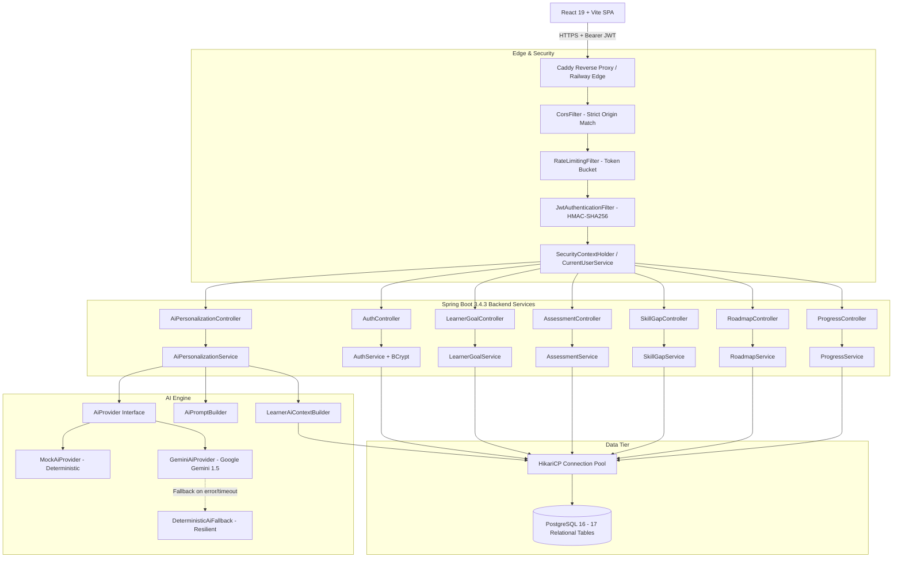
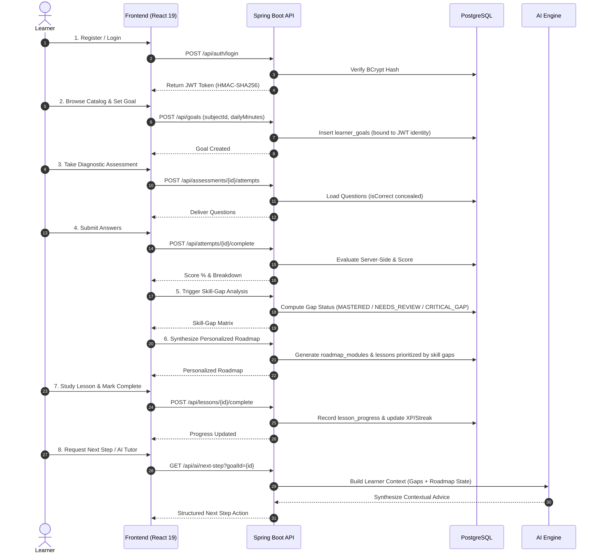

# BODHA (बोध) — System Architecture

## 1. System Vision & Architecture Philosophy

**BODHA** is an AI-powered personalized learning and skill-development platform designed to support any domain—from Software Engineering and Advanced Mathematics to Linguistics and Business Leadership.

Unlike generic LLM wrappers or conversational chatbots that provide ephemeral, unstructured text answers, BODHA is a **stateful, pedagogical learning system**:
- It maintains persistent learner state across multi-week curricula.
- It calibrates knowledge baselines using diagnostic tests.
- It isolates granular skill gaps at the concept level.
- It dynamically generates sequenced, milestone-based roadmaps tailored to each learner's time commitment and goal.
- It grounds AI recommendations in verified telemetry (score percentages, active gaps, completed lessons).

---

## 2. High-Level System Architecture

The following diagram illustrates the complete end-to-end architecture across client, API gateway/controllers, service domain layers, database, and AI providers:

---

## 3. Technology Stack & Component Details

### 3.1 Frontend Architecture
- **Framework:** React 19 SPA (Single Page Application)
- **Build Tool:** Vite 8.3
- **Styling:** Vanilla CSS design tokens + Tailwind CSS 3.4
- **Icons:** Lucide React
- **Routing:** React Router DOM 7
- **State Management:** React Context API (`LearnerContext.jsx`)
  - Centralizes authentication state, active goal, current roadmap, lesson progress, and answer key state.
  - Automatically loads telemetry upon login.
  - Manages session persistence in `localStorage` (`bodha_jwt_token`, `bodha_user_profile`).
- **HTTP Client:** Centralized `apiFetch` abstraction (`frontend/src/services/api.js`)
  - Automatically attaches `Authorization: Bearer <token>` to all protected requests.
  - Intercepts HTTP 401 Unauthorized responses and executes automated auto-logout.
  - Formats error payloads cleanly for UI display.
- **Production Web Server:** Caddy HTTP/2 reverse proxy on Railway providing SPA rewrite routing (`try_files {path} /index.html`).

### 3.2 Backend Architecture
- **Framework:** Spring Boot 3.4.3
- **Runtime:** Java 21 LTS
- **Build System:** Apache Maven 3.9+
- **Security & Identity:**
  - Spring Security 6.4 with stateless session management (`SessionCreationPolicy.STATELESS`).
  - JJWT 0.12.6 for cryptographically signed HMAC-SHA256 tokens.
  - BCrypt password encoder (10 rounds).
  - `CurrentUserService`: Extracts authenticated user ID directly from `SecurityContextHolder`, preventing client-side ID spoofing or cross-tenant parameter tampering.
- **Data Access:** Spring Data JPA + Hibernate 6.6 with explicit `PostgreSQLDialect`.
- **Connection Pool:** HikariCP with connection validation and optimized pool sizing (5 connections in production for minimal memory footprint).
- **Rate Limiting:** In-memory token bucket rate limiter (`InMemoryRateLimiter`) with automatic 15-minute idle bucket eviction:
  - `POST /api/auth/login`: 10 requests / minute (IP-based).
  - `POST /api/auth/register`: 5 requests / minute (IP-based).
  - `/api/ai/**`: 20 requests / minute (User ID or IP-based).
- **Error Handling:** `GlobalExceptionHandler` with `@RestControllerAdvice`:
  - Sanitizes SQL and database exceptions (`DataAccessException`, `SQLException`), returning HTTP 500 without leaking schema or credentials.
  - Handles bean validation errors (`MethodArgumentNotValidException`), returning structured field-level 400 responses.
  - Handles rate limiting violations, returning HTTP 429 with `Retry-After: 60`.

### 3.3 Database Tier
- **Database Engine:** PostgreSQL 16
- **Architecture:** 17 relational tables with strict referential integrity (`ON DELETE CASCADE` / `ON DELETE RESTRICT`), foreign key indexes, and enum check constraints.
- **Data Zero-Reset Policy:** All migrations and schema structures are designed to be backward compatible and non-destructive.

---

## 4. End-to-End Learner Journey (Data Flow)

---

## 5. Security & Isolation Architecture

1. **Stateless Authentication:** Bearer JWT tokens signed with HMAC-SHA256. Passwords, hashes, and secrets are strictly excluded from token claims and serialized payloads.
2. **Server-Side Identity:** Endpoints never trust client-supplied `userId` query parameters or JSON fields. Identity is derived directly from the verified token principal via `CurrentUserService.requireCurrentUserId()`.
3. **Cross-Tenant Isolation:** Resource ownership checks verify that assessment attempts, goals, skill gaps, roadmaps, and progress records belong to the calling user before executing mutations or reads.
4. **Defense in Depth:**
   - Preflight CORS checks with explicit origin whitelisting (`CORS_ALLOWED_ORIGINS`).
   - Rate limiting on vulnerable authentication and AI endpoints.
   - Standard security headers (`X-Content-Type-Options: nosniff`, `X-Frame-Options: DENY`, `Referrer-Policy: strict-origin-when-cross-origin`, `Permissions-Policy`).
   - SQL exception sanitization preventing database metadata exposure.
